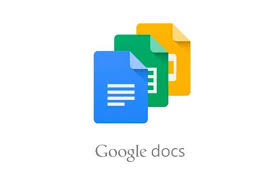
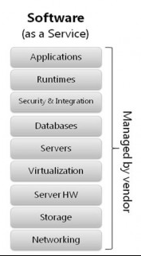

# Praktikum Teknologi Cloud Computing
Nama : Edi Permadi
|| Nim  : 175410046
***

## SaS ( Software As a Service)
SAS (Statistical Analysis System) adalah program komputer untuk analisis statistika yang dikembangkan oleh perusahaan SAS Institute. Perangkat lunak ini dirancang untuk keperluan berbagai bidang dengan fitur Analisis Statistika, Riset Operasi, dan Managemen Proyek.

Keuntungan:

    - Pengguna dapat langsung memanfaatkan layanan secara gratis  atau dengan bayar biaya sewa tanpa harus mengeluarkan investasi untuk membuat sendiri (in-house development) atau membeli lisensi yang relatif mahal.

    - Ketersediaan dan reliabilitas aplikasi terjamin oleh penyedia layanan. Pengguna hanya perlu fokus pada data miliknya. Perangkat yang dibutuhkan oleh pengguna juga hanya komputer dan internet.

Kerugian:

    - Pengguna tidak memiliki kendali penuh atas aplikasi yang disewa. Pengguna tidak dapat dengan seenaknya mengubah fitur-fitur yang disediakan karena SaaS bersifat multi-tenant sehingga fitur-fitur yang dibuat adalah fitur yang umum (tidak bisa spesifik terhadap kebutuhan pengguna tertentu). Pada beberapa aplikasi, kustomisasi dapat dilakukan dengan skala dan fungsi yang terbatas.

***
## Contoh SaaS ( Software As a Service)
- Google Doc,Google Spreadshet, Google Presentation

- Facebook

- DropBox

## Arsitektur SaaS

Model SaaS meliputi konsep-konsep dalam arsitektur aplikasi terdistribusi tetapi lebih lanjut memperluas arsitektur
untuk menyertakan komponen untuk memfasilitasi dan meningkatkan model bisnis. Sebuah vendor perangkat lunak
tradisional terutama berkaitan dengan kemampuan aplikasi dan pelanggan mereka yang bertanggung jawab untuk
mengoperasikan dan mengelola lingkungan yang bersangkutan di mana mereka menjalankan perangkat lunak. 
