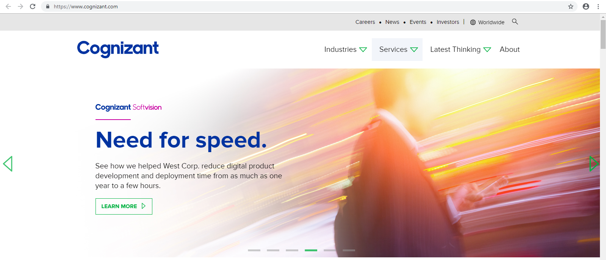
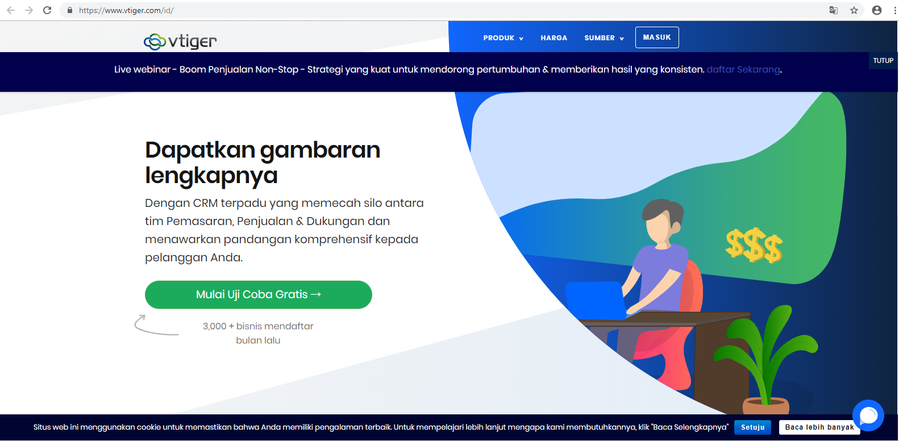

Nama : Edi Permadi
|| Nim  : 175410046
***

# BPaaS ( Business Process as a Service)

## Pengertian  
    Proses Bisnis Sebagai Layanan (BPaaS) adalah jenis proses bisnis horizontal atau vertikal yang disampaikan berdasarkan model layanan awan. Layanan awan ini - yang mencakup Perangkat Lunak sebagai Layanan (SaaS), Platform sebagai Layanan (PaaS), dan Infrastruktur sebagai Layanan (IaaS) - oleh karena itu bergantung pada layanan terkait.
    Perusahaan telah mengotomatisasi proses bisnis selama beberapa dekade. Awalnya, mereka terpaksa melakukannya secara manual atau pemrograman. Misalnya, jika perusahaan ingin memastikan bahwa sistem manajemen untuk pesanan mendongak cek kredit sebelum mengeluarkan transaksi, perusahaan membuat permintaan itu ke dalam sebuah program.

## Karakteristik berikut menentukan BPAaS:

1. BPaaS duduk di atas tiga layanan awan pendiri lainnya: SaaS, PaaS, dan IaaS.

2. Layanan BPaaS dapat dikonfigurasi berdasarkan proses yang sedang dirancang.

3. Layanan BPaaS harus memiliki API yang terdefinisi dengan baik sehingga mudah dihubungkan ke layanan terkait.

4. BPaaS harus dapat mendukung banyak bahasa dan beberapa lingkungan penerapan karena bisnis tidak dapat memprediksi bagaimana proses bisnis akan dimanfaatkan di masa depan.

5. Lingkungan BPaaS harus bisa menangani skala besar. Layanan harus bisa pergi dari pengelolaan beberapa proses untuk beberapa pelanggan untuk dapat mendukung ratusan bahkan ribuan pelanggan dan proses. Layanan ini mencapai tujuan tersebut dengan mengoptimalkan layanan awan yang mendasari untuk mendukung jenis elastisitas dan penskalaan ini.

***
## Salah Satu web yang menyediakan BPaaS  
1. http://www.cognizant.com/
    
menyediakan Layanan Bpaas :
- Research And analytics
  Menyediakan layanan yg terdiri dari  Financial Research, Business/Market Research,etc 
- Finance and accounting
  Menyediakan layanan yg terdiri dari Customized Services, etc
- Vertical Markets 
   Menyediakan layanan yg terdiri dari Banking and Financial Services , Insurance, Life Sciences, etc

2. https://www.vtiger.com/id/
   
Vtiger (https://www.vtiger.com/id/) merupakan solusi aplikasi CRM  paling populer. Aplikasi ini  membantu perusahaan untuk mengorganisir dan memelihara informasi secara efisien di dalam segala aspek yang berkaitan dengan customer. Fitur – fitur inti di dalamnya antara lain:

-  Customer Relationship Management: Membantu manage semua data-data customer, dari Accounts, Contact sampai Prospect atas customer yang bersangkutan.

- Sales Force Automation: Melakukan penjualan produk dan billing atas customer. Terdapat menu Quotation, Sales Order hingga Invoice.

-  Customer Service Tracking: Menampilkan layanan purna jual di dalam perusahaan. Baik itu complaint maupun service produk. Bisa ditelusuri juga sudah sampai sejauh manakah service customer yang bersangkutan.

-  News Service: Semacam memo atau notes yang membantu kita mengingatkan akan hal-hal kecil yang mudah terlupakan.

-  Corporate Calendar: Mencatat semua event / kalender penting bagi aktifitas perusahaan. Semua jadwal atau agenda kerja akan muncul di menu ini.

-  Analytical Reports: Menyediakan laporan-laporan yang sudah teranalisis dengan baik oleh system.

-  Material Management: Berisi fitur mengenai management produk di dalam perusahaan. Baik dari segi produk sampai penambahan dari segi pembelian (Purchase Order) dan pengurangan produk dari segi Penjualan (Sales Order dan Invoice).

-  Synchronization: Fitur yang bertujuan untuk mensikronisasi antara Vtiger dengan aplikasi email semacam Microsoft Outlook dan Mozilla Thunderbird.