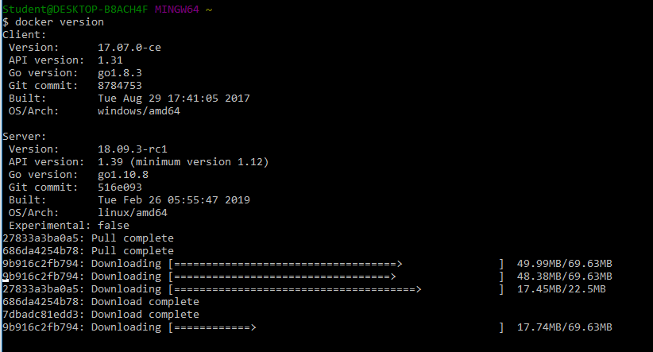

Nama : Edi Permadi
|| Nim  : 175410046
***
#COCKROACH

1. Install Menggunakan Docker for windows
    
    - Install Docker for Windows.

    Docker for Windows requires 64bit Windows 10 Pro and Microsoft Hyper-V. Please see the official documentation for more details. Note that if your system does not satisfy the stated requirements, you can try using Docker Toolbox.
   -  Open PowerShell and confirm that the Docker daemon is running in the background:
    PS C:\Users\username> docker version
    If you do not see the server listed, start Docker for Windows.

    - Share your local drives. This makes it possible to mount local directories as data volumes to persist node data after containers are stopped or deleted.

    - Pull the image for the v19.2.0-beta.20190930 release of CockroachDB from Docker Hub: 
    PS C:\Users\username> docker pull cockroachdb cockroach-unstable:v19.2.0-beta.20190930

    

2. Konfigurasi

3. Bikin Database
4. Bikin Tabel
5. Ui Data
6. Query data