# TCC
Nama : Edi Permadi  
NIM  : 175410046  

# Deploying your First Docker Container
1. Using the search command, Jane has identified that the    Redis Docker Image is called redis and wants to run the latest release. Because Redis is a database, Jane wants to run it as a background service while she continues to work.
To complete this step, launch a container in the background running an instance of Redis based on the official image.
The Docker CLI has a command called run which will start a container based on a Docker Image. The structure is docker run <options> <image-name>.
By default, Docker will run a command in the foreground. To run in the background, the option -d needs to be specified.

        docker run -d redis
    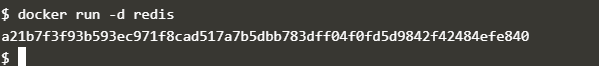

2. Finding Running Containers  
The launched container is running in the background, the docker ps command lists all running containers, the image used to start the container and uptime.

        docker ps
    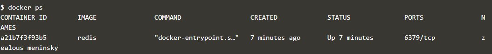

3. Accessing Redis  
 the best way to solve her problem of running Redis in the background, with a name of redisHostPort on port 6379 is using the following command  

        docker run -d --name redisHostPort -p 6379:6379 redis:latest

    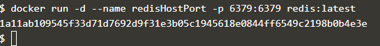

4. Accessing Redis  
After experimenting, Jane discovers that just using the option -p 6379 enables her to expose Redis but on a randomly available port. She decides to test her theory using

        docker run -d --name redisDynamic -p 6379 redis:latest
        
   
    While this works, she now doesn't know which port has been assigned. Thankfully, this is discovered via

        docker port redisDynamic 6379
    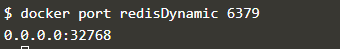  
    Jane also finds that listing the containers displays the port mapping information,
    
        docker ps
    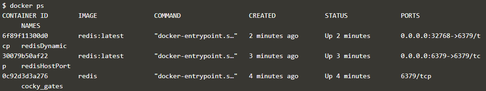

5. Persisting Data  
Any data which needs to be saved on the Docker Host, and not inside containers, should be stored in /opt/docker/data/redis.

        docker run -d --name redisMapped -v /opt/docker/data/redis:/data redis

    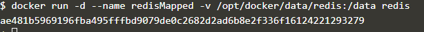

6. Running A Container In The Foreground
    The command docker run ubuntu ps launches an Ubuntu container and executes the command ps to view all the processes running in a container. 
    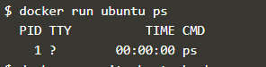 

    Using docker run -it ubuntu bash allows Jane to get access to a bash shell inside of a container.

    

# Create nginx static web server

1. Create your Dockerfile for building your image 

        Copy to EditorFROM nginx:alpine
        COPY . /usr/share/nginx/html

The first line defines our base image. The second line copies the content of the current directory into a particular location inside the container.

2. Build Docker Image
Build our static HTML image using the build command below.

        docker build -t webserver-image:v1 .
    
    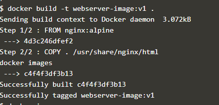

    You can view a list of all the images on the host using  
    
        docker images.
    
    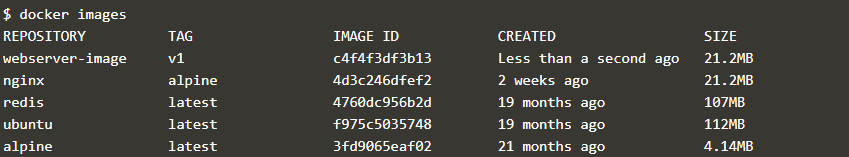

3. Run
Launch our newly built image providing the friendly name and tag. As it's a web server, bind port 80 to our host using the -p parameter.

        docker run -d -p 80:80 webserver-image:v1

    

    Once started, you'll be able to access the results of port 80 via 

        curl docker
    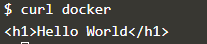

    To Open  
    
        https://2886795311-80-kitek05.environments.katacoda.com/

    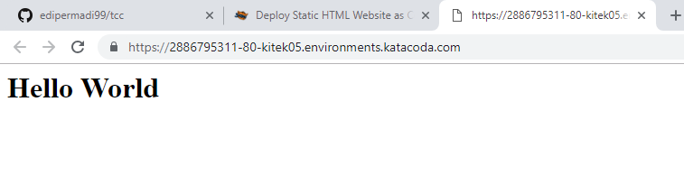