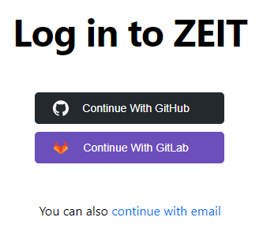
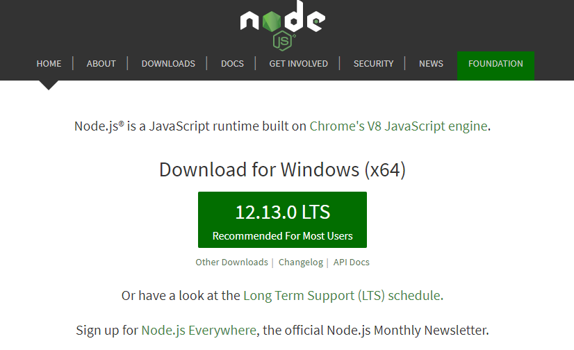
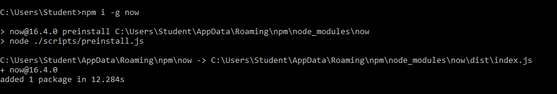
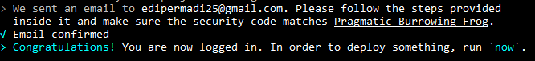
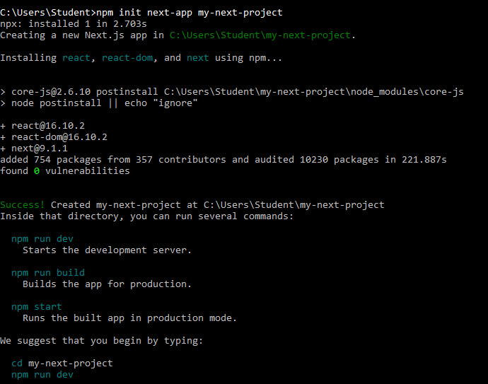
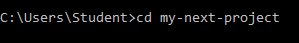
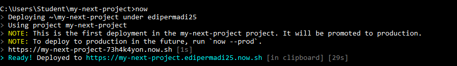
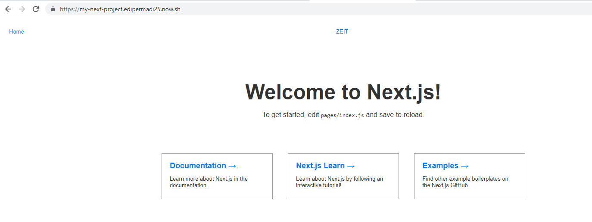

# TCC
Nama : Edi Permadi  
NIM  : 175410046 

1. Membuka Zeit yaitu dengan membuka alamat web https://zeit.co/
2. Login Mengggunakan akun github  
    
3. Install Node.js  
    

4. Install Zeit  

        npm i -g now
    

5. Login 

        now login
    

## Creating a Project and Deploying
1. Anda dapat membuat aplikasi Next.js baru dengan perintah berikut menggunakan npm atau Yarn:

        npm init next-app my-next-project
        
    

2. Menuju Folder my-next-project

        cd my-next-project
    
3. Deploying your new Next.js project with Now CLI.

        now
    

4. Membuka Link

        https://my-next-project.edipermadi25.now.sh/ 

    