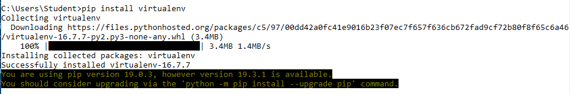
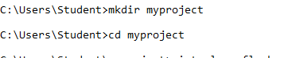

# TCC
Nama : Edi Permadi  
NIM  : 175410046 

1. Buka command prompt dan ketikan perintah:  

    pip install virtualenv
    
2. Membuat direktori atau folder untuk aplikasi kita dengan cara mengetikan perinta: mkdir myproject, misal saya buat folder myproject di drive C. Tulisan myproject dapat diganti dengan nama sesuai keinginan kita.  

    

3. Kemudian ketikan perintah: 

        virtualenv flask.

    Setelah perintah tersebut dieksekusi maka dalam folder myproject akan dibuat folder flask yang berisi folder Include, Lib, dan Scripts seperti terlihat dalam gambar di bawah.  

    

4. Kemudian ketikan perintah untuk menginstal flask sebagai berikut:   

        flask\Scripts\pip install flask

5. Buat direktori app di folder myproject dengan perintah: mkdir app
Kemudian masuk ke folder app dan buat folder baru bernama: static, templates dengan perintah mkdir. Sehingga dalam folder app terdapat folder static dan template.

6. Maka pada tahan ini kita telah selesai melakukan instalasi flask di windows dan siap digunakan.

7. Setelah instalasi selesai selanjutnya kita kan mencoba membuat sebuah aplikasi sederhana untuk mengetes apakah benar flask sudah bisa dijalankan di komputer kita. Dengan menggunakan editor atau bis amenggunakan IDLE kemudian buat file .py yang d berisi sebagai berikut:  

         from flask import Flask

            app = Flask(__name__)

        @app.route('/')

        def index():
            return "Hello WOrld!"

        if __name__ == "__main__":
            app.run(debug = True)

