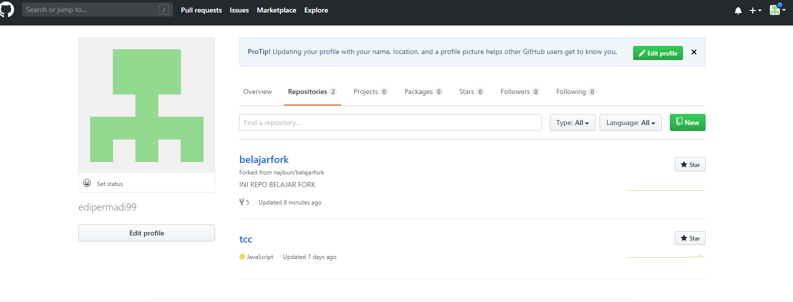
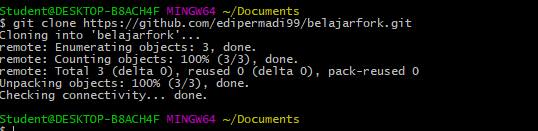
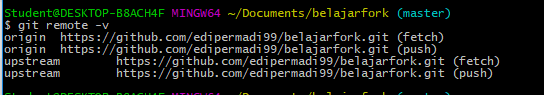
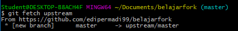
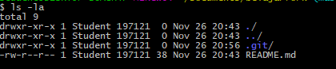

# TCC
Nama : Edi Permadi  
NIM  : 175410046 

## Fork
Fork adalah membuat clone dari suatu repo di GitHub milik upstream author, diletakkan ke milik kontributor. Fork hanya dilakukan sekali saja. Pada dasarnya, proses untuk fork ini meliputi:

Fork repo di web GitHub.
Clone fork tersebut di komputer lokal.
Kontributor harus mem-fork repo upstream author sehingga di repo kontributor muncul repo tersebut. Proses forking ini dijelaskan dengan langkah-langkah berikut:

1. Login ke GitHub https://github.com/najibun/belajarfork/fork

    

2. Setelah proses, repo dari upstream author sudah berada di account GitHub kita (kontributor)  

      

3. Setelah proses tersebut, clone di komputer lokal:  

      

4. Setelah itu, konfigurasikan repo lokal kontributor. Pada kondisi saat ini, di komputer lokal sudah terdapat repo playground-1 yang berada pada direktori dengan nama yang sama. Untuk keperluan berkontribusi, ada 2 nama repo yang harus diatur:

    - origin: menunjuk ke repo milik kontributor di GitHub, hasil dari fork.
    - upstream: menunjuk ke repo milik upstream author (repo asli) di account najibun.
5. Repo origin sudah dituliskan konfigurasinya pada saat melakukan proses clone dari repo kontributor. Konfigurasi repo upstream harus dibuat.  

        $ git remote -v
        origin	https://github.com/bpdp/playground-1 (fetch)
        origin	https://github.com/bpdp/playground-1 (push)
        $
6. Tambahkan remote upstream:
$ git remote add upstream https://github.com/edipermadi99/belajarfork.git

7. Hasil
  

## Mengirimkan Pull Request  

Setiap kali melakukan perubahan, kirim perubahan tersebut. Pengiriman ini disebut dengan Pull Request. Pada posisi ini, kontributor bisa mengirimkan kontribusi dengan cara mengirimkan pull request (PR) ke upstream author. Secara umum, langkah-langkahnya adalah sebagai berikut:

- Kontributor akan bekerja di repo lokal (create, update, delete isi)
- Commit
- Push ke repo kontributor
- Kirimkan PR ke repo upstream author.
- Upstream author me-review dan kemudian menyetujui (merge) ke master atau menolak PR.
- Jika disetujui dan di-merge ke repo master dari upstream author, sinkronkan repo di komputer lokal dan repo GitHub kontributor.

Berikut ini adalah contoh pengiriman perubahan isi README.md dengan menambahkan kontributor.

## Membuat Perubahan di Repo Lokal
Sebelum melakukan perubahan, pastikan:

1. Sudah ada koordinasi secara manual tentang perubahan-perubahan yang akan dilakukan.
2. Setelah melakukan perubahan-perubahan, pastikan bahwa isi repo lokal tersinkronisasi dengan repo dari upstream author.
3. Cara melakukan sinkronisasi:  

    

4. Lakukan perubahan-perubahan, setelah itu push ke origin (milik kontributor)
    
    
    
